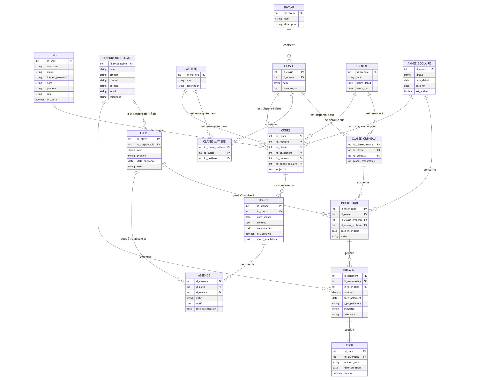

# Islah School

Bienvenue dans le projet Islah School, une application web pour la gestion de la petite école Islah. 

Ce projet est divisé en deux parties :

- **Backend** : API REST de l'application, développée avec **FastAPI** et **PostgresSQL**. Elle utilise aussi **Docker** et ***Docker compose** pour conteneuriser et gérer le tout. (Voir le [README](./backend/README.md))
- **Frontend** : Interface utilisateur de l'application, développée avec **NextJS**. (à refaire)

L'architecture de l'application a été conçue progressivement, pour répondre aux besoins de l'école Islah. pour plus d'informations, veuillez consulter la [documentation](./backend/architecture.md).

Une documentation détaillée de l'API est disponible après avoir lancé l'application sur [Swagger](http://localhost:8000/docs). Toutefois, vous pouvez consulter la documentation de l'API [ici](./backend/api.md) pour plus d'informations car il faut une authentification pour pouvoir tester certaines routes.