# Islah School

Islah School est une petite école privée située au coeur de la moquée Islah situé à 70 Rue des Sorins, 93100 Montreuil. L'école est ouverte à tous les enfants à partir de l'âge de 3 ans. L'école donne des cours de coran, écrirure, lecture, invocations (dua), histoire de prophète (sira) et bien d'autres matières les jours hors calendrier scolaire. Les Mercredis, samedis et dimanches. 

Il existe plusieurs niveaux:  2 niveaux de maternelle, 3 niveaux de primaire et bien d'autres. Les classes sont crée par créneau horaire: 

- Classe du matin => 10h-13h avec une pause de 11h20 jusqu'à 12h00. 
- Classe de l'après-midi => 14h-17h avec une pause de 15h20 jusqu'à 16h00.

D'autres classes sont crée en fonction des besoins.

Chaque classe a une place limitée d'élèves et on peu avoir plusieurs classes pour un même niveau. Les classes sont crée en fonction des besoins. 

## Système actuel

Le système actuel est basé sur des feuilles de papier et quelques fois l'utilisation de classeur excel. Les inscriptions se font sur place et les parents doivent se déplacer pour inscrire leurs enfants. Les inscriptions se font en fonction des places disponibles. L'inscription est validée une fois le paiement effectué. Un paiement initial de frais d'inscription puis un paiement trimestriel. Le paiement se fait en espèèce, par chèque ou par Carte Bancaire. Un reçu est donné à chaque paiement. Rien n'est mis en place pour informer les parents de quelconque évènement, paiements à effectuer (L'école ne s'en rend pas compte si le parent lui même ne vient pas déclarer et régler par bonne foi), etc. Il n'y a pas de reinscription, les parents doivent remplir un formulaire d'inscriptions à chaque année scolaire, s'il ne le font pas à temps, ils perdent leur place au profit d'un autre enfant. Les enfant on un bulletin de note à chaque fin de trimestre, bulletin qui est fait à la main grâce à un modèle de feuille excel. Lorsqu'un enfant est absent, rien n'est remarqué et aucun suivi n'est fait. En cas de plainte, ou de revandication concernant un paiement, une recherche manuelle parmis les dossiers est faite pour retrouver la trace du paiement et le dossier de l'enfant, ce qui peut prendre du temps et n'est pas toujours trouvé. Un des problèmes récurrents est de savoir qui a fait quel inscription d'enfant au sein de l'équipe chargée des inscriptions ainsi en cas de quelconque soucis, il est difficile de remonter à la source.

## Objectif

Le système actuel est très peu fiable et peu pratique. L'objectif est de créer un système de gestion de l'école qui permettra de gérer les inscriptions, les paiements, les absences, les notes, les évènements, les informations des parents, les informations des enfants, les informations des enseignants, les informations des classes, les informations des niveaux, les informations des matières, les informations des horaires, les informations des salles, les informations des plannings, les informations des emplois du temps, les informations des bulletins de notes et bien d'autres. Le système doit être simple, intuitif, fiable, sécurisé et pratique. Il doit permettre de gérer l'école de A à Z.

## Notes

Un essie de backend a été fait avec FastAPI, un framework python pour la création d'API REST. Il est à refaire car il n'est pas adapté au cas spécifique de l'école. Une attention particulière sera accordé à la modélisation de la base de données avant de commencer le développement.

## MCD (à revoir)

```mermaid
erDiagram
    UTILISATEUR {
        int id PK
        string email
        string mot_de_passe
        string nom
        string prenom
        string telephone
        string role
        date date_creation
        date derniere_connexion
        boolean actif
    }
    
    ELEVE {
        int id PK
        string nom
        string prenom
        date date_naissance
        string genre
        string adresse
        string photo
        string id_externe
        boolean actif
        date date_inscription
    }
    
    PARENT {
        int id PK
        int utilisateur_id FK
        string profession
        string telephone_secondaire
    }
    
    ENSEIGNANT {
        int id PK
        int utilisateur_id FK
        string specialite
        date date_embauche
        string telephone_urgence
    }
    
    CLASSE {
        int id PK
        string nom
        string niveau
        string annee_scolaire
        string creneau
        int capacite_max
        boolean active
    }
    
    INSCRIPTION {
        int id PK
        int eleve_id FK
        int classe_id FK
        date date_inscription
        string statut
        date date_fin
    }
    
    PARENT_ELEVE {
        int parent_id FK
        int eleve_id FK
        string relation
        boolean contact_principal
        boolean autorise_recuperation
    }
    
    PRESENCE {
        int id PK
        int eleve_id FK
        int classe_id FK
        date date
        time heure_arrivee
        boolean present
        string commentaire
        int enregistre_par FK
    }
    
    ABSENCE_JUSTIFICATION {
        int id PK
        int presence_id FK
        string motif
        string description
        string document_url
        date date_soumission
        boolean validee
        int validee_par FK
    }
    
    PAIEMENT {
        int id PK
        int eleve_id FK
        decimal montant
        date date_paiement
        string methode
        string reference
        string type
        string statut
        string commentaire
        int enregistre_par FK
    }
    
    FACTURE {
        int id PK
        int eleve_id FK
        decimal montant
        date date_emission
        date date_echeance
        string statut
        string description
        string reference
    }
    
    BULLETIN {
        int id PK
        int eleve_id FK
        int classe_id FK
        string trimestre
        string annee_scolaire
        date date_publication
        string statut
        int publie_par FK
    }
    
    EVALUATION {
        int id PK
        int bulletin_id FK
        string matiere
        string note
        string appreciation
        int enseignant_id FK
    }
    
    EMPLOI_TEMPS {
        int id PK
        int classe_id FK
        string jour
        time heure_debut
        time heure_fin
        string matiere
        int enseignant_id FK
        string salle
    }
    
    NOTIFICATION {
        int id PK
        int utilisateur_id FK
        string titre
        string contenu
        date date_creation
        boolean lue
        string type
        string lien
    }
    
    MESSAGE {
        int id PK
        string titre
        string contenu
        date date_envoi
        string type
        int envoye_par FK
    }
    
    MESSAGE_DESTINATAIRE {
        int message_id FK
        int utilisateur_id FK
        boolean lu
        date date_lecture
    }
    
    DEMANDE_ACCES {
        int id PK
        string email
        string nom
        string prenom
        string telephone
        string fonction
        string message
        date date_demande
        string statut
        int traite_par FK
        date date_traitement
    }
    
    CONFIGURATION {
        int id PK
        string cle
        string valeur
        string description
        string categorie
    }

    UTILISATEUR ||--o{ PARENT : "est"
    UTILISATEUR ||--o{ ENSEIGNANT : "est"
    PARENT ||--o{ PARENT_ELEVE : "a"
    ELEVE ||--o{ PARENT_ELEVE : "a"
    ELEVE ||--o{ INSCRIPTION : "est inscrit"
    CLASSE ||--o{ INSCRIPTION : "contient"
    ELEVE ||--o{ PRESENCE : "a"
    CLASSE ||--o{ PRESENCE : "pour"
    UTILISATEUR ||--o{ PRESENCE : "enregistre"
    PRESENCE ||--o{ ABSENCE_JUSTIFICATION : "peut avoir"
    UTILISATEUR ||--o{ ABSENCE_JUSTIFICATION : "valide"
    ELEVE ||--o{ PAIEMENT : "concerne"
    UTILISATEUR ||--o{ PAIEMENT : "enregistre"
    ELEVE ||--o{ FACTURE : "reçoit"
    ELEVE ||--o{ BULLETIN : "reçoit"
    CLASSE ||--o{ BULLETIN : "pour"
    UTILISATEUR ||--o{ BULLETIN : "publie"
    BULLETIN ||--o{ EVALUATION : "contient"
    ENSEIGNANT ||--o{ EVALUATION : "donne"
    CLASSE ||--o{ EMPLOI_TEMPS : "a"
    ENSEIGNANT ||--o{ EMPLOI_TEMPS : "enseigne"
    UTILISATEUR ||--o{ NOTIFICATION : "reçoit"
    UTILISATEUR ||--o{ MESSAGE : "envoie"
    MESSAGE ||--o{ MESSAGE_DESTINATAIRE : "est envoyé à"
    UTILISATEUR ||--o{ MESSAGE_DESTINATAIRE : "reçoit"
    UTILISATEUR ||--o{ DEMANDE_ACCES : "traite"
```

